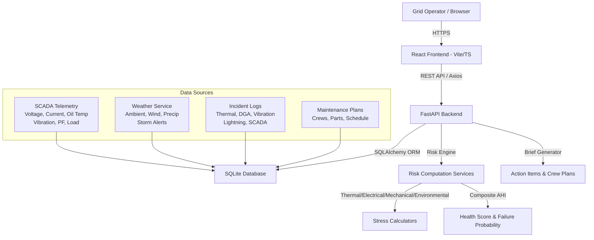

# Solution Overview

## What We Built

**GridWatch AI** — A production-grade predictive risk engine for electrical power grid transformer assets. It ingests real-time SCADA telemetry, multi-zone weather data, and historical incident logs to compute a live Asset Health Index (AHI) for every monitored transformer, generating failure probabilities, risk tiers (Critical/High/Medium/Low), time-to-failure estimates, and prioritized dispatcher action plans — all through a modern React dashboard backed by a FastAPI risk engine.

## How It Works

1. **Data Ingestion & Seeding**
   - 20 grid assets (TX-101 through TX-120) across 5 zones (North, South, East, West, Central) are registered with geospatial coordinates, capacity ratings, and installation dates
   - 30 days of hourly sensor telemetry (voltage, current, oil temperature, vibration, power factor, load %) — 3,600+ readings — are seeded
   - Multi-zone weather observations (ambient temp, humidity, wind, precipitation, solar irradiance, storm alerts) for 30 days
   - 12 scripted grid incidents (thermal runaway, bushing discharge, vibration exceedance, lightning surge, DGA anomalies) with severity and status
   - 3 maintenance work orders for high-risk assets with crew assignments, parts lists, and schedules

2. **Real-Time Risk Computation** (every 60 seconds or on-demand)
   - **Thermal Stress**: Load %, oil temperature, ambient temperature → normalized 0.0–1.0 index
   - **Electrical Stress**: Voltage deviation from nominal (138 kV), power factor penalty → 0.0–1.0
   - **Mechanical Stress**: Vibration Hz vs. 2.0 Hz baseline → core looseness indicator
   - **Environmental Stress**: Wind speed, precipitation, storm alerts → external threat index
   - **Composite Health Score (AHI)**: Weighted deduction from 100.0 (pristine) down to 5.0 (critical)
     - Thermal: 35% weight
     - Electrical: 25% weight
     - Mechanical: 20% weight
     - Environmental: 10% weight
     - Open incidents: up to 25 points
     - Asset age: up to 10 points
   - **Failure Probability**: `(100 - AHI) / 100` → 0.02 to 0.98
   - **Risk Tier Mapping**:
     - Critical: AHI ≤ 35 or failure prob ≥ 0.65
     - High: AHI ≤ 60 or failure prob ≥ 0.40
     - Medium: AHI ≤ 78 or failure prob ≥ 0.22
     - Low: AHI > 78

3. **Action Plan Generation**
   - **Immediate** (Critical): Emergency de-energization, rapid crew dispatch within 2 hours
   - **Urgent** (High): Thermal scan, oil analysis within 24 hours, 25% load curtailment
   - **Medium**: Preventative maintenance queue for next regional outage
   - **Routine** (Low): Standard 60-second polling continues

4. **Operator Brief Synthesis**
   - Grid-wide status: NOMINAL / ELEVATED_RISK / CRITICAL_ALERT
   - Asset counts by risk tier
   - Prioritized action items with deadlines
   - Crew deployment roster (active work orders + synthesized emergency dispatches)
   - Natural-language executive summary

5. **Dashboard Visualization**
   - **Login/Landing**: Branded operator entry point
   - **Dashboard**: KPIs (total assets, critical/high/medium/low counts, grid status), recent alerts
   - **Risk Map**: Leaflet map with color-coded asset markers, click-through to detail
   - **Fleet**: Tabular asset list with filterable risk tiers, health scores, zones
   - **Asset Detail**: Telemetry charts (Recharts), incident timeline, maintenance plans, risk history
   - **Action Plan**: Prioritized dispatcher actions + crew deployments + executive brief

## Architecture Diagram

## Key Design Decisions

| Decision | Rationale |
|---|---|
| **FastAPI + SQLAlchemy 2.0** | High-performance async API, type-safe ORM, automatic OpenAPI docs for judge evaluation |
| **SQLite (file-based)** | Zero-config deployment for hackathon judges; portable single-file database with 3,600+ seeded records |
| **Deterministic Risk Engine** | No external ML dependencies — reproducible, auditable, explainable scores for regulatory compliance |
| **React + TypeScript + Tailwind** | Modern, type-safe UI with utility-first styling; fast Vite dev server for live demo |
| **Leaflet + Recharts** | Zero-dependency map (no API keys) + declarative charting for telemetry visualization |
| **Zone-based Weather Correlation** | Assets grouped by 5 geographic zones; weather stress applied per-zone for realism |
| **Auto-seeding on Startup** | Database self-initializes with full dataset — judges run one command and see working app |

## IBM Technologies Used

This project demonstrates core AI/ML engineering principles applicable to **watsonx.ai** and **IBM Bob** integration patterns:

- **Structured Prompting** → The risk engine's weighted stress calculations mirror how foundation models would be prompted for multi-factor risk assessment
- **Explainable AI** → Each risk tier maps to a named primary factor (Thermal, Electrical, Mechanical, Environmental, Incidents) — directly translatable to watsonx.ai explainability features
- **Agentic Workflow Ready** → The Action Plan API (`/api/action-plan/brief`) outputs structured JSON for crew dispatch — designed for IBM Bob agent consumption
- **MCP-Compatible** → FastAPI endpoints follow REST conventions compatible with Model Context Protocol servers

*Note: This hackathon submission uses a deterministic rule-based engine for transparency and zero external dependencies. In production, the stress calculators and AHI weights would be calibrated via watsonx.ai fine-tuning on historical failure data.*